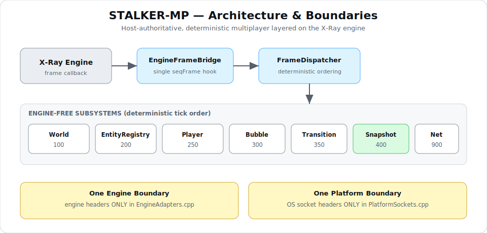
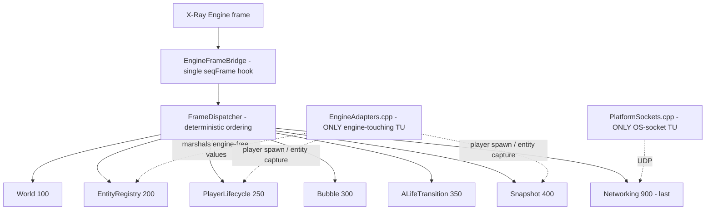
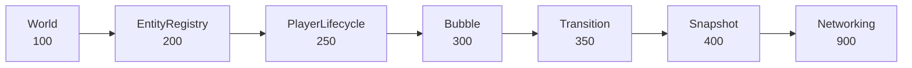

# STALKER-MP

**A host-authoritative, deterministic multiplayer framework for the X-Ray (S.T.A.L.K.E.R. Anomaly / Monolith) engine.**



> _Diagrams are provided as SVG in `docs/images/` (rendered above) and as inline Mermaid diagrams below (rendered directly by GitHub)._

---

## Overview

STALKER-MP is a modular multiplayer framework layered **on top of** the X-Ray Monolith engine used by S.T.A.L.K.E.R. Anomaly. It adds host-authoritative networking, a persistent world, player lifecycle management, and an immutable snapshot pipeline — **without forking or rewriting the engine**. The framework compiles into a single static library (`xrMP.lib`) that links into the engine executable, and it is built sprint-by-sprint under a strict architecture-first workflow with independent verification at every step.

The project treats the engine as an upstream dependency and interacts with it through a single, tightly controlled boundary. Everything else — world abstraction, entity registry, activation ("bubbles"), ALife online/offline transitions, host networking, player lifecycle, and snapshots — is engine-free, deterministic, and unit-tested on both GCC and MSVC.

---

## Vision & Goals

- **Persistent, shared Zone.** A single authoritative world that multiple players inhabit, where offline/online simulation is driven by the host, not the client.
- **Host authority, always.** Clients request; the host decides. No client ever owns persistent world state.
- **Deterministic and replay-safe.** Identical inputs produce identical state, enabling reliable networking, persistence, and debugging.
- **Preserve before replace.** Reuse vanilla engine systems (ALife, spawning, navigation) rather than reimplementing them.
- **Incremental & verifiable.** Every subsystem is designed, frozen, implemented one step at a time, and independently verified before the next begins.

---

## Architecture Overview

STALKER-MP is a layered set of subsystems fanned out from a single engine frame callback through a deterministic dispatcher. Only one translation unit touches engine headers (the **One Engine Boundary**); only one touches OS sockets (the **One Platform Boundary**).



**Deterministic per-frame pipeline** (ascending `tick_order` keys; networking is always last and owns no simulation):



See the architecture SVG in `docs/images/` and the Mermaid pipeline above; per-subsystem documentation lives in `Multiplayer/docs/`.

---

## Core Principles

These invariants are enforced across every sprint and verified independently:

- **Preserve Before Replace** — reuse vanilla engine systems; never fork ALife or the spawn machinery.
- **Host Authority** — the host owns every state transition; clients issue requests only.
- **One World / One ALife Simulation** — a single authoritative simulation; no duplicate state.
- **Deterministic Simulation & Replay Determinism** — identical inputs → identical state and outputs.
- **One Engine Boundary** — engine headers appear in exactly one translation unit (`EngineAdapters.cpp`).
- **One Platform Boundary** — OS socket headers appear in exactly one translation unit (`PlatformSockets.cpp`).
- **Clients never own persistent world state.**
- **Incremental, frozen architecture** — architecture is frozen before implementation; each step is independently verified.

---

## Frozen ADR Summary

Architecture Decision Records are the durable, versioned source of truth (see `Documentation/Architecture/ADR/`). The currently binding decisions:

| ADR | Title | Essence |
|---|---|---|
| **ADR-007** | Engine ABI Contract (Exception & STL Policy) | Engine-linked TUs are exception-free, RTTI-free, iostream-free; fallible operations return `core::Expected<T>` / value outcomes; `/W4 /WX`, C4530-clean. |
| **ADR-008** | Engine State Mutation Boundary | Engine simulation state is mutated only through sanctioned, id-based cooperative paths behind a single gateway; observation is read-only. |
| **ADR-009** | One Platform Boundary | All OS socket/platform types are confined to one transport translation unit behind an engine-free seam. |
| **ADR-010** | Wire Protocol Contract | Fixed, field-by-field little-endian framing; control vs. data id ranges; additive, never-renumbered message ids. |
| **ADR-011** | Single-Threaded / Deterministic Networking | Networking is single-threaded and tick-derived; future worker threads consume only immutable snapshots, never live state. |

All framework code conforms to ADR-007 through ADR-011; no ADR has been superseded.

---

## Sprint Roadmap & Progress

| Sprint | Subsystem | Status |
|---|---|---|
| **001** | Core (bootstrap, config, logging, service registry) | ✅ Verified (Closed) |
| **002** | World (FrameDispatcher, WorldManager, queries, environment) | ✅ Verified (Closed) |
| **003** | Entity Registry (identity/metadata store, engine feed) | ✅ Verified (Closed) |
| **004** | Bubble Manager (activation regions, hysteresis) | ✅ Verified (Closed) |
| **005** | ALife Transition Layer (online/offline switching) | ✅ Verified (Closed) |
| **006** | Host Networking Infrastructure (transport, session, wire) | ✅ Verified (Closed) |
| **007** | Player Lifecycle (persistent players, join/reconnect) | ✅ Verified (Closed) |
| **008** | Snapshot System (immutable snapshots) | ✅ Verified (Closed) |
| **009** | Replication Pipeline | ✅ Verified (Closed) |
| **010** | Client Prediction & Interpolation | ✅ Verified (Closed) |
| **011** | Persistence Framework | ✅ Verified (Closed) |
| **012** | **Save/Load System** | ✅ **Verified (Closed)**  |
| 013–014 | Extensibility (Lua, plugin loader) | Progress(7/18)|
| 015 | Diagnostics / Optimization | ⏳ Planned |

**Sprint-008 (Snapshot System) — Verified (Closed):** the immutable, deterministic per-tick capture of world state that decouples asynchronous consumers (replication, persistence, replay) from live simulation. All 14 steps were implemented one at a time and independently verified.

**Sprint-009 (Replication Pipeline) — Verified (Closed):** the host-authoritative consumer that transforms immutable snapshots into prioritized, delta-encoded, bandwidth-efficient network updates. All 16 steps were implemented one at a time and independently verified; replication owns no entities, executes no gameplay, and mutates no simulation. Subsystem documentation: `Multiplayer/docs/Replication.md`.

**Sprint-010 (Client Prediction & Interpolation) — Verified (Closed):** the client-side presentation layer — local-player prediction, remote-entity interpolation, and deterministic host-wins reconciliation — that consumes replication output and never mutates authoritative simulation. All 17 steps were implemented one at a time and independently verified; the `ClientPresentationDriver` runs as a synchronous phase after `FrameDispatcher::Dispatch` (not a subscriber — no new `tick_order` key, networking-last preserved), in identity mode on the host. Subsystem documentation: `Multiplayer/docs/Prediction.md`.

**Sprint-011 (Persistence Framework) — Verified (Closed):** the host-side infrastructure that coordinates when and how safely authoritative snapshots are handed off for saving — scheduling, a synchronous (no-thread) worker, a bounded queue with back-pressure, read-only snapshot consumption, version tracking, validation, and diagnostics — without any save format or serialization (Sprint-012). All 17 steps were implemented one at a time (some as safe batches) and independently verified; the `PersistenceManager` ticks at the reserved `tick_order::kPersistence = 500`, storage is behind the engine-free `IPersistenceStore` seam, and no thread is created (ADR-011). Subsystem documentation: `Multiplayer/docs/Persistence.md`.

**Sprint-012 (Save/Load System) — Verified (Closed):** the authoritative world is serialized deterministically (byte-identical, wall-clock excluded) and reconstructed host-side before networking. All 18 steps were implemented across ten verification batches (with the four architectural gates verified in isolation) and independently verified: the deterministic serialization format + `SaveWriter`/`SaveReader`; integrity validation + version migration; the real filesystem backend behind the frozen `IPersistenceStore` seam (confined to `PlatformSaveStore.cpp`); the engine-free restore-sink boundary with the real authoritative writes confined to `EngineAdapters.cpp`; `SaveManager` + `RecoveryPipeline` (Load → Validate → Migrate → Restore, failure-isolated); and diagnostics. Recovery runs once during `Bootstrap Initialize` **before** the frame bridge and networking — no new `tick_order` key, no new subscriber, no thread (ADR-011); the wire protocol is untouched (ADR-010). Subsystem documentation: `Multiplayer/docs/SaveLoad.md`.

**Current focus — Sprint-013 (Lua Integration):** script integration and API bindings atop the now functionally-complete multiplayer framework.

---

## Current Implementation Status

- **Sprints 001–011:** implemented, independently verified, and closed.
- **Sprint-011 (Persistence Framework) — closed:** all 17 steps delivered and verified — persistence value types + `PersistenceConfiguration`; the `VersionManager`; the deterministic `SaveMetadataBuilder` (content checksum); the read-only `PersistenceSnapshot` projection over the Sprint-008 `ISnapshotView`; the pure `ValidationFramework`; the bounded `PersistenceQueue` with back-pressure; the engine-free `IPersistenceStore` seam (+ in-memory/null backends); the **synchronous, no-thread** `PersistenceWorker` (failure-isolated, retain-previous); the deterministic `SaveScheduler`; the `PersistenceManager` (`IService` + `ITickable`) at `tick_order::kPersistence = 500`; error-handling/recovery hardening; the non-invasive `PersistenceDiagnostics`; the Bootstrap composition-root wiring with reverse-order teardown; composed-stack integration; and the subsystem documentation in `Multiplayer/docs/Persistence.md`. **No engine TU, no OS/file/serialization code, no thread** (save format/serialization/load are Sprint-012); evidence gates E-G1-PF…E-G5-PF passed.
- **Sprint-010 (Client Prediction & Interpolation) — closed:** all 17 steps delivered and verified — prediction value types + `PredictionConfiguration`; the bounded ascending `InputBuffer` / `StateBuffer`; the pure fixed-timestep `PredictionStep::Integrate`; the `PredictionManager` (record → predict → deterministic host-wins `Reconcile` with prune/snap/replay); the `SnapshotBuffer` (bracketing frames, no extrapolation); the pure `InterpolationStep` (position lerp + shortest-arc yaw); the `InterpolationManager` (ascending, unique, append-only remote states); the engine-free seams `ILocalInputSource` / `IAuthoritativeStateSource` / `IPresentationSink`; the validation-hardening negative surface; the non-invasive `PredictionDiagnostics`; the synchronous `ClientPresentationDriver`; the engine adapter (`EngineLocalInputSource` / `EnginePresentationSink` + `PredictionSeams`, engine headers confined to `EngineAdapters.cpp`); and the Bootstrap composition-root wiring — a post-`Dispatch` phase (no new `tick_order` key; networking-last preserved), identity mode on the host, reverse-order teardown — with composed-stack integration and the subsystem documentation in `Multiplayer/docs/Prediction.md`. Client-only presentation; **no authoritative-state mutation**; evidence gates E-G1-P…E-G5-P passed.
- **Sprint-009 (Replication Pipeline) — closed:** all 16 steps delivered and verified — replication value types + configuration; the immutable `ReplicationUpdate` + `IReplicationView`; the `ReplicationClientRegistry` (per-client baselines); the engine-free interest seam + `BubbleInterestPolicy`; the deterministic `DeltaEncoder`; the frozen §7.A reliability/priority classifier; the exception-free FIFO `ReplicationQueues`; the deterministic little-endian `ReplicationPacketBuilder` with additive wire ids (`0x0200`/`0x0201`); the synchronous `ReplicationWorker`; the `ReplicationManager` (`IService` + `ITickable`) at `tick_order::kReplicationPipeline = 450`; the Bootstrap composition-root wiring with reverse-order teardown; the non-invasive `ReplicationDiagnostics` collector; the validation-hardening negative surface; and the subsystem documentation in `Multiplayer/docs/Replication.md`. **No new engine TU and no OS code** (replication consumes engine-free seams); evidence gates E-G1-R…E-G5-R passed.
- **Sprint-008 (Snapshot System) — closed:** all 14 steps delivered and verified — value types + configuration; the immutable `SimulationSnapshot` + `ISnapshotView`; the exception-free fixed-capacity `SnapshotPool`; the additive engine-free `world::IEntitySnapshotSource` capture seam + null; the deterministic value-only `SnapshotBuilder`; the single-producer / multi-consumer `SnapshotQueue`; the per-tick `SnapshotManager` (`IService` + `ITickable`) at `tick_order::kReplication = 400`; the engine-boundary `adapters::EngineEntitySnapshotSource` (the sole new engine TU) with its engine-free marshaling helper; the Bootstrap composition-root wiring with reverse-order teardown; the read-only `SnapshotDiagnostics` inspector; the validation-hardening negative surface; and composed-stack integration with the subsystem documentation in `Multiplayer/docs/Snapshots.md`. Evidence gates E-G1-S / E-G2-S / E-G3-S passed, E-G4-S confirmed.
- **Engine boundary:** intact — engine headers confined to `Multiplayer/src/adapters/EngineAdapters.cpp`.
- **Platform boundary:** intact — OS socket headers confined to `Multiplayer/src/adapters/PlatformSockets.cpp`.

## Test Status

- **675 / 675 build tests passing** (Release x64) on **GCC** and **MSVC.** **Game testing has not started yet**.
- **0 errors, 0 warnings, no regressions.**
- Engine-free subsystems are fully unit-tested with mock/loopback/null substrates (no engine, no OS, no threads required for the test build).
- The single engine-touching and OS-touching translation units are verified on Windows.

---

## Build Requirements

- **Windows** with **Visual Studio 2022** (MSVC v143 toolset), C++17.
- **GCC** (for the engine-free test build / CI parity), C++17.
- The X-Ray **Monolith** engine sources (S.T.A.L.K.E.R. Anomaly engine).

> **Engine dependency (not vendored).** The upstream X-Ray engine is large and is **not** committed to this repository. Obtain the Anomaly / X-Ray Monolith engine separately and place it under `Engine/` (git-ignored). The framework builds as `Multiplayer/xrMP.sln` and links `xrMP.lib` into the engine executable.

**Building the framework + tests:**

```
# Open the framework solution in Visual Studio 2022:
Multiplayer/xrMP.sln          # xrMP (static lib) + xrMP_Tests (GoogleTest runner)

# Test build is engine-free and OS-free — no engine checkout required to run the suite.
```

---

## Repository Structure

```
STALKER-MP/
├── Multiplayer/                 # The STALKER-MP framework (this project)
│   ├── include/stalkermp/       # Public headers (core, world, net, player, snapshot, adapters)
│   ├── src/                     # Implementation
│   │   └── adapters/            # EngineAdapters.cpp (One Engine Boundary),
│   │                            # PlatformSockets.cpp (One Platform Boundary)
│   ├── tests/                   # GoogleTest suite (engine-free / OS-free)
│   ├── docs/                    # Per-subsystem & per-sprint architecture docs
│   └── xrMP.sln                 # Framework + test solution
├── Documentation/
│   ├── Architecture/ADR/        # Architecture Decision Records (ADR-007…011)
│   ├── SPRINTS/                 # Frozen sprint architectures, plans, step specs
│   └── AI/                      # Status, session log, decisions, roadmap
├── docs/images/                 # README diagrams (placeholders + exports)
├── Engine/                      # Upstream X-Ray engine (external; git-ignored)
├── README.md
├── .gitignore
└── VERSION.md / CHANGELOG.md / RELEASE_NOTES.md
```

---

## Contribution Guidelines

STALKER-MP follows an **architecture-first, frozen-then-implement** workflow. Contributions must respect it:

1. **Architecture before code.** New subsystems begin with a design/architecture document that is reviewed and **frozen** before any implementation.
2. **Implementation Plan → Step Specifications → Implementation.** Work proceeds in small, independently verifiable steps; each step is specified, implemented, and verified before the next.
3. **Respect the boundaries.** Never add engine headers outside `EngineAdapters.cpp` or OS headers outside `PlatformSockets.cpp`.
4. **Conform to the ADRs.** No exceptions/RTTI/iostream in engine-linked code (ADR-007); use `core::Expected<T>` and value outcomes.
5. **Determinism is non-negotiable.** No wall-clock in control flow; tick-derived logic; add replay/determinism tests for stateful code.
6. **Tests required.** Every step ships unit tests that pass on GCC and MSVC with zero new warnings.
7. **Do not modify frozen documents** (ADRs, frozen sprint architectures/plans/specs) except via a new, explicitly superseding decision.

Please open an issue to discuss substantial changes before submitting a pull request.

---

## License

_License to be determined._ A license file (`LICENSE`) will be added before public release. Until then, all rights are reserved by the project authors. Note that the upstream X-Ray engine is governed by its own separate license and is **not** included in this repository.

---

## Credits

- **STALKER-MP framework** — architecture, implementation, and verification by the STALKER-MP project.
- **X-Ray Engine / S.T.A.L.K.E.R.** — GSC Game World (engine) and the OpenXRay / S.T.A.L.K.E.R. Anomaly community (Monolith engine).
- **Testing** — GoogleTest.

STALKER-MP is a community project and is not affiliated with or endorsed by GSC Game World.
