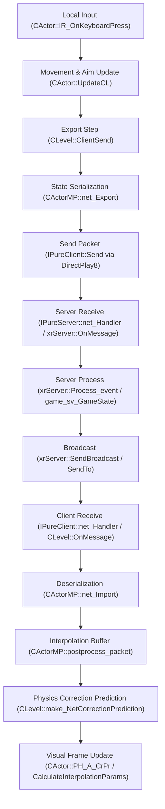

# Legacy Multiplayer Infrastructure Investigation

This document details the reverse engineered legacy multiplayer infrastructure found inside the `xray-monolith` engine repository. All findings are backed by verified source code locations.

---

## 1. Multiplayer Classes Search

The following classes represent the core multiplayer framework within the engine:

### `CActorMP`
* **Defined In**: 
  - Header: [actor_mp_client.h](file:///c:/Users/sukhs/Downloads/Games/STALKER-MP/Engine/xray-monolith/src/xrGame/actor_mp_client.h#L8)
  - Source: `actor_mp_client.cpp`, `actor_mp_client_export.cpp`, `actor_mp_client_import.cpp`
* **Inheritance**: `public CActor`, `public IAnticheatDumpable`
* **Role**: Client-side multiplayer agent representation that manages state replication (net_Export/net_Import) and interpolation buffers (`NET` and `NET_A`).

### `game_cl_mp`
* **Defined In**: 
  - Header: [game_cl_mp.h](file:///c:/Users/sukhs/Downloads/Games/STALKER-MP/Engine/xray-monolith/src/xrGame/game_cl_mp.h#L127)
  - Source: `game_cl_mp.cpp`
* **Inheritance**: `public game_cl_GameState`
* **Role**: Core client-side game state controller for multiplayer, managing connection phases, HUD widgets, team structures, and voting.

### `game_sv_mp`
* **Defined In**: 
  - Header: [game_sv_mp.h](file:///c:/Users/sukhs/Downloads/Games/STALKER-MP/Engine/xray-monolith/src/xrGame/game_sv_mp.h#L32)
  - Source: `game_sv_mp.cpp`
* **Inheritance**: `public game_sv_GameState`
* **Role**: Core server-side game state controller for multiplayer, managing client info, banned players, server-side vote validation, and spawning parameters.

### `game_cl_GameState` / `game_sv_GameState`
* **Defined In**: 
  - `game_cl_GameState`: [game_cl_base.h](file:///c:/Users/sukhs/Downloads/Games/STALKER-MP/Engine/xray-monolith/src/xrGame/game_cl_base.h#L27)
  - `game_sv_GameState`: [game_sv_base.h](file:///c:/Users/sukhs/Downloads/Games/STALKER-MP/Engine/xray-monolith/src/xrGame/game_sv_base.h#L33)
* **Inheritance**: 
  - `game_cl_GameState`: `public game_GameState`, `public ISheduled`
  - `game_sv_GameState`: `public game_GameState`
* **Role**: General base classes handling game rules, timers, and basic synchronization interfaces.

### `game_cl_Deathmatch` / `game_sv_Deathmatch`
* **Defined In**: 
  - `game_cl_Deathmatch`: [game_cl_deathmatch.h](file:///c:/Users/sukhs/Downloads/Games/STALKER-MP/Engine/xray-monolith/src/xrGame/game_cl_deathmatch.h#L16)
  - `game_sv_Deathmatch`: [game_sv_deathmatch.h](file:///c:/Users/sukhs/Downloads/Games/STALKER-MP/Engine/xray-monolith/src/xrGame/game_sv_deathmatch.h#L11)
* **Inheritance**: 
  - `game_cl_Deathmatch`: `public game_cl_mp`
  - `game_sv_Deathmatch`: `public game_sv_mp`

### `game_cl_TeamDeathmatch` / `game_sv_TeamDeathmatch`
* **Defined In**: 
  - `game_cl_TeamDeathmatch`: [game_cl_teamdeathmatch.h](file:///c:/Users/sukhs/Downloads/Games/STALKER-MP/Engine/xray-monolith/src/xrGame/game_cl_teamdeathmatch.h#L7)
  - `game_sv_TeamDeathmatch`: [game_sv_teamdeathmatch.h](file:///c:/Users/sukhs/Downloads/Games/STALKER-MP/Engine/xray-monolith/src/xrGame/game_sv_teamdeathmatch.h#L5)
* **Inheritance**: 
  - `game_cl_TeamDeathmatch`: `public game_cl_Deathmatch`
  - `game_sv_TeamDeathmatch`: `public game_sv_Deathmatch`

### `game_cl_ArtefactHunt` / `game_sv_ArtefactHunt`
* **Defined In**: 
  - `game_cl_ArtefactHunt`: [game_cl_artefacthunt.h](file:///c:/Users/sukhs/Downloads/Games/STALKER-MP/Engine/xray-monolith/src/xrGame/game_cl_artefacthunt.h#L6)
  - `game_sv_ArtefactHunt`: [game_sv_artefacthunt.h](file:///c:/Users/sukhs/Downloads/Games/STALKER-MP/Engine/xray-monolith/src/xrGame/game_sv_artefacthunt.h#L5)
* **Inheritance**: 
  - `game_cl_ArtefactHunt`: `public game_cl_TeamDeathmatch`
  - `game_sv_ArtefactHunt`: `public game_sv_TeamDeathmatch`

### `IPureClient` / `IPureServer`
* **Defined In**: 
  - `IPureClient`: [NET_Client.h](file:///c:/Users/sukhs/Downloads/Games/STALKER-MP/Engine/xray-monolith/src/xrNetServer/NET_Client.h#L29)
  - `IPureServer`: [NET_Server.h](file:///c:/Users/sukhs/Downloads/Games/STALKER-MP/Engine/xray-monolith/src/xrNetServer/NET_Server.h#L154)
* **Role**: Native Windows DirectPlay8 low-level wrapper interface classes (initializing `IDirectPlay8Client` and `IDirectPlay8Server` respectively).

### `xrServer`
* **Defined In**: [xrServer.h](file:///c:/Users/sukhs/Downloads/Games/STALKER-MP/Engine/xray-monolith/src/xrGame/xrServer.h#L89)
* **Inheritance**: `public IPureServer`
* **Role**: Primary server interface controller in `xrGame` that maps client IDs to entity objects and manages event dispatching.

---

## 2. Player Networking Pipeline Call Graph

The end-to-end synchronization pipeline follows this exact chain:



---

## 3. Packet Type Indexing

All packet IDs are defined inside [xrMessages.h](file:///c:/Users/sukhs/Downloads/Games/STALKER-MP/Engine/xray-monolith/src/xrServerEntities/xrMessages.h):

| Packet Enum ID | DirectPlay Message ID / Code Location | Purpose / Usage | Status & Reusability |
|---|---|---|---|
| `M_UPDATE` | Line 11 | Server-to-client global/game rules sync. | **Active**: Handled by client game state `net_import_update`. |
| `M_CL_UPDATE` | Line 33 | Client-to-server object update serialization. | **Active**: Sent by client inside `CLevel::ClientSend` (Line 197). |
| `M_CL_INPUT` | Line 30 | Replicated local control entity input vector. | **Unused**: Defined/parsed but no code writes this packet. |
| `M_EVENT` | Line 28 | Wrapper envelope for discrete gameplay events. | **Active**: Main packet for hits, inventory events, spawn status. |
| `M_SPAWN` | Line 13 | Full entity state for initialization on client. | **Active**: Handled by `CLevel::g_sv_Spawn`. |
| `M_CHANGE_LEVEL` | Line 39 | Direct client command to load another map. | **Active**: Server triggers level transition. |
| `M_CHAT` | Line 25 | In-game text messaging payload wrapper. | **Active**: Handled by multiplayer game state managers. |
| `M_GAMEMESSAGE` | Line 47 | Gameplay notifications (e.g., scores, rounds). | **Active**: Handled on client. |
| `M_PLAYER_FIRE` | Line 72 | Explicit signal that a player fired a weapon. | **Active**: Serialized in `ActorInput.cpp` (Line 72). |

---

## 4. CActorMP Complete Investigation

`CActorMP` (client representation) overrides key aspects of `CActor`:
* **`net_Export(NET_Packet& P)`** ([actor_mp_client_export.cpp:L117](file:///c:/Users/sukhs/Downloads/Games/STALKER-MP/Engine/xray-monolith/src/xrGame/actor_mp_client_export.cpp#L117)): Gathers physics net states (`SPHNetState`) and packages them via `m_state_holder.write(P)`.
* **`net_Import(NET_Packet& P)`** ([actor_mp_client_import.cpp:L11](file:///c:/Users/sukhs/Downloads/Games/STALKER-MP/Engine/xray-monolith/src/xrGame/actor_mp_client_import.cpp#L11)): Parses health, radiation, active inventory slot, updates yaw/pitch/roll camera angles for remote players, and pushes state to `NET` and `NET_A` buffers.
* **`postprocess_packet(net_update_A& N_A)`** ([actor_mp_client_import.cpp:L108](file:///c:/Users/sukhs/Downloads/Games/STALKER-MP/Engine/xray-monolith/src/xrGame/actor_mp_client_import.cpp#L108)): Stores past states in a deque (maximum size 5) and activates interpolation (`m_bInterpolate = true`).

---

## 5. Interpolation & Prediction Search

* **`CLevel::make_NetCorrectionPrediction()`** ([Level.cpp:L1564](file:///c:/Users/sukhs/Downloads/Games/STALKER-MP/Engine/xray-monolith/src/xrGame/Level.cpp#L1564)): Orchestrates the entire correction prediction loop. Runs prediction steps on `physics_world()`.
* **`CActor::PH_A_CrPr()`** ([Actor_Network.cpp:L1035](file:///c:/Users/sukhs/Downloads/Games/STALKER-MP/Engine/xray-monolith/src/xrGame/Actor_Network.cpp#L1035)): Restores recalculated physics positions and calls `CalculateInterpolationParams()`.
* **`CInventoryItem::interpolate_states()`** ([inventory_item.cpp:L1187](file:///c:/Users/sukhs/Downloads/Games/STALKER-MP/Engine/xray-monolith/src/xrGame/inventory_item.cpp#L1187)): Spherical linear interpolation (`slerp`) of physics body quaternions and linear position vectors over frames.

---

## 6. Weapon Firing Sync Trace

```
1. Mouse Input: ActorInput.cpp (IR_OnKeyboardPress: kWPN_FIRE)
   └─ Calls inventory().Action(kWPN_FIRE, CMD_START)
2. Weapon Action: WeaponFire.cpp (CWeapon::FireStart)
   └─ Triggers CShootingObject::FireStart() & bullet initialization
3. Packet Creation: ActorInput.cpp (Line 72)
   └─ P.w_begin(M_PLAYER_FIRE) -> P.w_u16(ID()) -> u_EventSend(P)
4. Server Broadcaster: xrServer.cpp (Line 691)
   └─ Receives M_PLAYER_FIRE -> Forwards via SendBroadcast(BroadcastCID, P, MODE)
5. Remote Client Dispatcher: Level_network_messages.cpp (CLevel::OnMessage)
   └─ Receives M_PLAYER_FIRE -> dispatches weapon animation & local visual fire effects.
```

---

## 7. Inventory Action Sync Trace

All item management actions utilize `GE_INV_ACTION` or dedicated events:

* **Drop Item**:
  - Event: `GE_OWNERSHIP_REJECT` ([Inventory.cpp:L922](file:///c:/Users/sukhs/Downloads/Games/STALKER-MP/Engine/xray-monolith/src/xrGame/Inventory.cpp#L922))
  - Server Handler: `Process_event_reject` ([xrServer_process_event.cpp:L109](file:///c:/Users/sukhs/Downloads/Games/STALKER-MP/Engine/xray-monolith/src/xrGame/xrServer_process_event.cpp#L109))
* **Pick Item / Take Item**:
  - Event: `GE_OWNERSHIP_TAKE` ([Inventory.cpp:L326](file:///c:/Users/sukhs/Downloads/Games/STALKER-MP/Engine/xray-monolith/src/xrGame/Inventory.cpp#L326))
  - Server Handler: `Process_event_ownership` ([xrServer_process_event.cpp:L91](file:///c:/Users/sukhs/Downloads/Games/STALKER-MP/Engine/xray-monolith/src/xrGame/xrServer_process_event.cpp#L91))
* **Equip Weapon / Reload / Use Items (Bandage/Medkit)**:
  - Event: `GE_INV_ACTION` ([Inventory.cpp:L672](file:///c:/Users/sukhs/Downloads/Games/STALKER-MP/Engine/xray-monolith/src/xrGame/Inventory.cpp#L672))
  - Serialization Layout: `cmd` (u16) + `flags` (u32) + `ZoomRndSeed` (s32) + `ShotRndSeed` (s32).
  - Server Handler: Forwards via `SendTo` directly to dedicated engine simulator thread ([xrServer_process_event.cpp:L71](file:///c:/Users/sukhs/Downloads/Games/STALKER-MP/Engine/xray-monolith/src/xrGame/xrServer_process_event.cpp#L71)).
