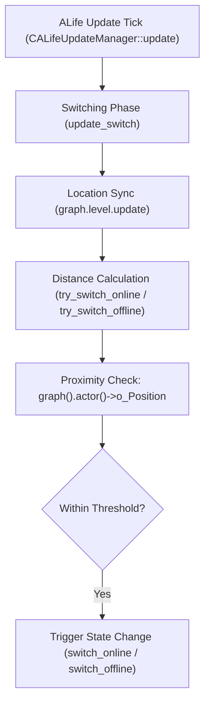
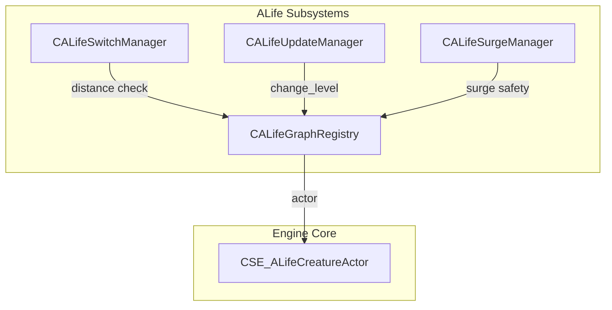

# targeted Engineering Investigation: Multi-Player Bubble Feasibility

This document presents the technical analysis of replacing the single-actor reference in the ALife simulation engine with a multi-player system (Bubble-centric distance evaluation).

---

## 1. Verified Source References (Actor Entry & References)

The player actor reference enters the ALife subsystem during server spawning when registering entities:

### 1.1 Actor Registration Entry Point
* **File**: [alife_graph_registry.cpp](file:///c:/Users/sukhs/Downloads/Games/STALKER-MP/Engine/xray-monolith/src/xrGame/alife_graph_registry.cpp#L49)
* **Function**: `CALifeGraphRegistry::update`
* **Line Reference**: Lines 54–58
  ```cpp
  if (object->s_flags.is(M_SPAWN_OBJECT_ASPLAYER))
  {
      m_actor = smart_cast<CSE_ALifeCreatureActor*>(object);
      R_ASSERT2(m_actor, "Invalid flag M_SPAWN_OBJECT_ASPLAYER for non-actor object!");
  }
  ```
  * **Purpose**: Identifies the spawned object with the player flag, performs a typecast to `CSE_ALifeCreatureActor`, and stores it in the private reference variable `m_actor`.

### 1.2 Proximity Evaluation (Switching Trigger)
* **File**: [alife_dynamic_object.cpp](file:///c:/Users/sukhs/Downloads/Games/STALKER-MP/Engine/xray-monolith/src/xrGame/alife_dynamic_object.cpp#L133)
* **Functions & Lines**:
  - `CSE_ALifeDynamicObject::try_switch_online()` (Lines 160–164):
    ```cpp
    if (alife().graph().actor()->o_Position.distance_to(o_Position) > alife().online_distance())
    ```
  - `CSE_ALifeDynamicObject::try_switch_offline()` (Lines 180–184):
    ```cpp
    if (alife().graph().actor()->o_Position.distance_to(o_Position) <= alife().offline_distance())
    ```
  * **Purpose**: Compares the distance from the player actor (`alife().graph().actor()`) to the dynamic entity with the configured thresholds.

---

## 2. Actor Proximity Switching Call Graph



---

## 3. Generalization Feasibility Classification

Evaluating replacement of `graph().actor()` with a nearest-player search:

| Function Name | Location | Class / Namespace | Complexity Class | Rationale |
|---|---|---|---|---|
| `try_switch_online` | [alife_dynamic_object.cpp:L160](file:///c:/Users/sukhs/Downloads/Games/STALKER-MP/Engine/xray-monolith/src/xrGame/alife_dynamic_object.cpp#L160) | `CSE_ALifeDynamicObject` | **Easy** | Trivial swap to iterate through a player array and compute the minimum distance to the entity. |
| `try_switch_offline` | [alife_dynamic_object.cpp:L180](file:///c:/Users/sukhs/Downloads/Games/STALKER-MP/Engine/xray-monolith/src/xrGame/alife_dynamic_object.cpp#L180) | `CSE_ALifeDynamicObject` | **Easy** | Same logic as `try_switch_online`. Switch offline only if the entity is outside *all* player radii. |
| `change_level` | [alife_update_manager.cpp:L159](file:///c:/Users/sukhs/Downloads/Games/STALKER-MP/Engine/xray-monolith/src/xrGame/alife_update_manager.cpp#L159) | `CALifeUpdateManager` | **Hard** | Level switching saves the entire state of the local actor. Multiple players on different maps would break the single-autosave loading model. |
| `setup_current_level` | [alife_graph_registry.cpp:L68](file:///c:/Users/sukhs/Downloads/Games/STALKER-MP/Engine/xray-monolith/src/xrGame/alife_graph_registry.cpp#L68) | `CALifeGraphRegistry` | **Hard** | Expects the single actor to define the active simulator level. Multi-map support requires multiple active registry worlds. |

---

## 4. Subsystems Impacted

The assumption of exactly one player actor is deeply embedded in:
* **Switch Manager**: Distance comparisons refer only to the actor position.
* **Level Streaming**: Map loading and transitions are locked to the player crossing level vertex boundaries ([alife_update_manager.cpp:L192](file:///c:/Users/sukhs/Downloads/Games/STALKER-MP/Engine/xray-monolith/src/xrGame/alife_update_manager.cpp#L192)).
* **Save/Load System**: Encodes actor state directly into game save files.
* **PDA & Quests**: Engine checks story ID relationships relative to Player 1 (`ID = 0`).

---

## 5. Dependency Graph



---

## 6. Risk Analysis & Open Questions

* **Performance Drawback**: Evaluating distances from all active entities to multiple players raises complexity from $O(N)$ to $O(N \cdot M)$ (where $M$ is player count).
* **Open Question**: How should story quests and events be triggered when player IDs differ from the hardcoded `ID = 0` assumption?
