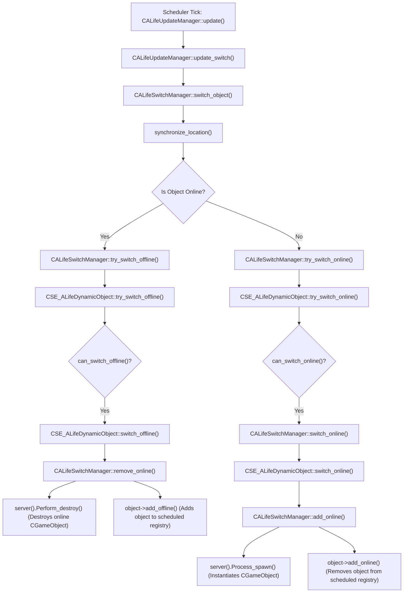

# Offline & Online Simulation Switching Mechanics

This document details how the ALife engine manages offline-to-online transitions, the objects registry storage structure, and squad group simulation updates.

---

## 1. Online / Offline Switching Call Graph

Switching is handled by `CALifeSwitchManager` and triggered on every scheduler tick inside `CALifeUpdateManager::update()`.

### Call Graph:

### Key Switching Functions:
* **`switch_object`**: [alife_switch_manager.cpp:L229](file:///c:/Users/sukhs/Downloads/Games/STALKER-MP/Engine/xray-monolith/src/xrGame/alife_switch_manager.cpp#L229)
* **`try_switch_online`**: [alife_switch_manager.cpp:L160](file:///c:/Users/sukhs/Downloads/Games/STALKER-MP/Engine/xray-monolith/src/xrGame/alife_switch_manager.cpp#L160)
* **`try_switch_offline`**: [alife_switch_manager.cpp:L203](file:///c:/Users/sukhs/Downloads/Games/STALKER-MP/Engine/xray-monolith/src/xrGame/alife_switch_manager.cpp#L203)
* **`switch_online`**: [alife_switch_manager.cpp:L106](file:///c:/Users/sukhs/Downloads/Games/STALKER-MP/Engine/xray-monolith/src/xrGame/alife_switch_manager.cpp#L106)
* **`switch_offline`**: [alife_switch_manager.cpp:L117](file:///c:/Users/sukhs/Downloads/Games/STALKER-MP/Engine/xray-monolith/src/xrGame/alife_switch_manager.cpp#L117)
* **`can_switch_online`**: [xrServer_Objects_ALife.cpp:L574](file:///c:/Users/sukhs/Downloads/Games/STALKER-MP/Engine/xray-monolith/src/xrServerEntities/xrServer_Objects_ALife.cpp#L574)
* **`can_switch_offline`**: [xrServer_Objects_ALife.cpp:L579](file:///c:/Users/sukhs/Downloads/Games/STALKER-MP/Engine/xray-monolith/src/xrServerEntities/xrServer_Objects_ALife.cpp#L579)

* **Distance Variables**:
  Calculated using `o_Position` relative to the local player actor:
  - Spawn Online threshold: `alife().online_distance()` ([alife_dynamic_object.cpp:L160](file:///c:/Users/sukhs/Downloads/Games/STALKER-MP/Engine/xray-monolith/src/xrGame/alife_dynamic_object.cpp#L160))
  - Despawn Offline threshold: `alife().offline_distance()` ([alife_dynamic_object.cpp:L180](file:///c:/Users/sukhs/Downloads/Games/STALKER-MP/Engine/xray-monolith/src/xrGame/alife_dynamic_object.cpp#L180))

---

## 2. Object Registry

* **Storage Type**:
  Stored in an standard associative map (`xr_map` key-value tree structure):
  `typedef xr_map<ALife::_OBJECT_ID, CSE_ALifeDynamicObject*> OBJECT_REGISTRY;` ([alife_object_registry.h:L22](file:///c:/Users/sukhs/Downloads/Games/STALKER-MP/Engine/xray-monolith/src/xrGame/alife_object_registry.h#L22))
* **Identifications**:
  Keyed by unique `ALife::_OBJECT_ID` (unsigned 16-bit integer representation of entities).

---

## 3. Squads

* **Representation**:
  Stalker squads, mutant squads, and simulation groups are represented by the unified server entity class:
  `CSE_ALifeOnlineOfflineGroup` ([xrServer_Objects_ALife_Monsters.h:L518](file:///c:/Users/sukhs/Downloads/Games/STALKER-MP/Engine/xray-monolith/src/xrServerEntities/xrServer_Objects_ALife_Monsters.h#L518)).
* **Member Management**:
  Exposes `register_member` and `unregister_member` methods to store subordinate entity IDs inside a private member list `m_members` ([alife_online_offline_group.cpp:L102](file:///c:/Users/sukhs/Downloads/Games/STALKER-MP/Engine/xray-monolith/src/xrGame/alife_online_offline_group.cpp#L102)).
* **Simulation Updates**:
  Updated by the offline scheduler registry (`scheduled().update()`) which calls `CSE_ALifeOnlineOfflineGroup::update()` ([alife_online_offline_group.cpp:L55](file:///c:/Users/sukhs/Downloads/Games/STALKER-MP/Engine/xray-monolith/src/xrGame/alife_online_offline_group.cpp#L55)). This method recalculates spatial coordinates based on the squad commander's position, and updates the squad's high-level AI state machine via `brain().update()` (Line 73).
